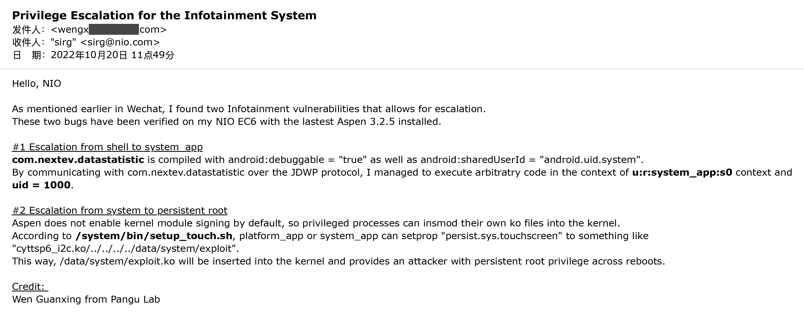

## Privilege Escalation for the Infotainment System

I have mentioned two 0days in my presentation at MOSEC 2022, "Feat(My First EV)!: Add Support for App Store". Now that NIO fix them in the lastest version of Aspen, details will be disclosed.

### Escalation from shell to system

**com.nextev.datastatistic** is compiled with android:debuggable = "true" as well as android:sharedUserId = "android.uid.system".
By communicating with com.nextev.datastatistic over the JDWP protocol, I managed to execute arbitratry code in the context of **u:r:system_app:s0** context and **uid = 1000**.

### Escalation from system to persistent root
Aspen does not enable kernel module signing by default, so privileged processes can insmod their own ko files into the kernel.
According to **/system/bin/setup_touch.sh**, **platform_app** or **system_app** can setprop "persist.sys.touchscreen" to something like "cyttsp6_i2c.ko/../../../../data/system/exploit".
In this way, /data/system/exploit.ko will be inserted into the kernel and provides an attacker with persistent root privilege across reboots.

### Original Bug Report Emailed to NIO 

